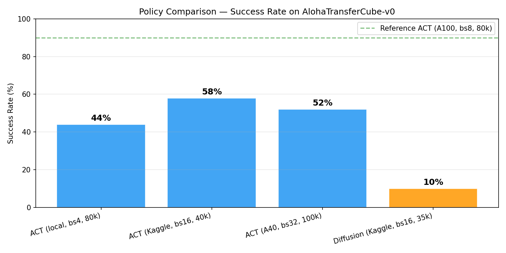
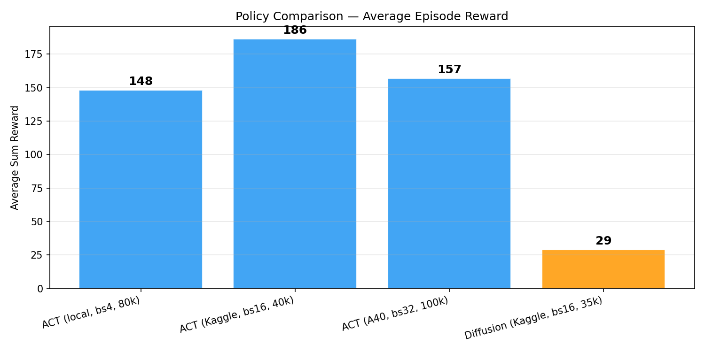
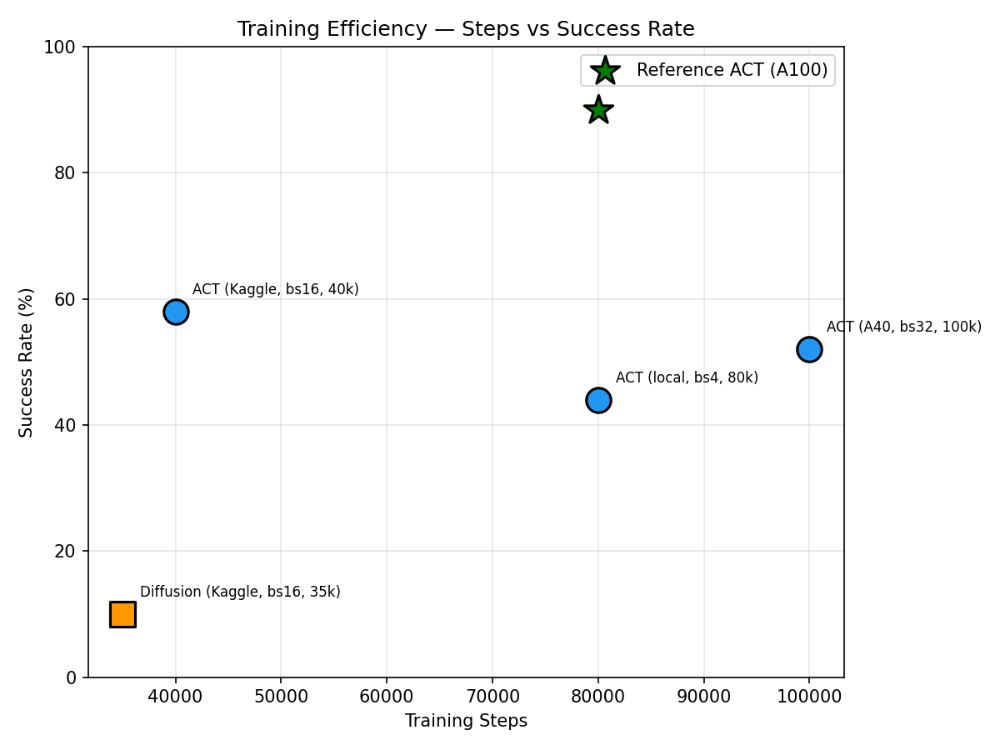
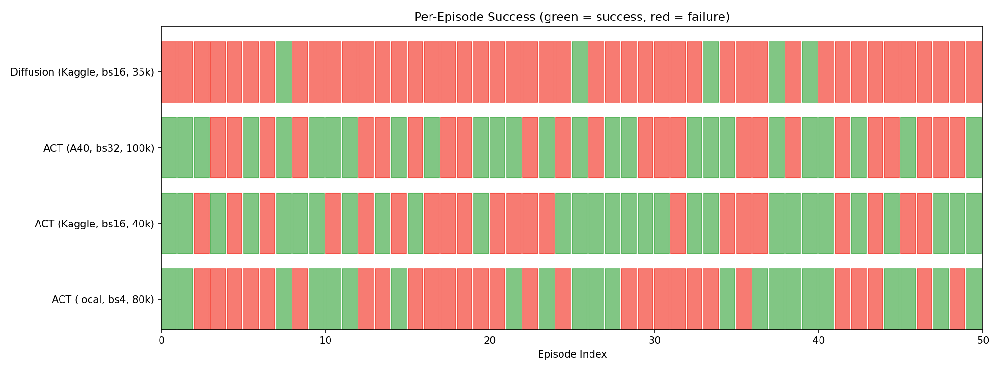

# Policy Comparison Report

## Task: AlohaTransferCube-v0

Pick up a cube with the right arm and transfer it to the left arm.
50 human demonstration episodes, 400 frames each, 50fps.

---

## Results Summary

| Run | Policy | Steps | Batch Size | GPU | Success Rate | Avg Reward |
|-----|--------|-------|------------|-----|-------------|------------|
| ACT (local, bs4, 80k) | ACT | 80,000 | 4 | GTX 1650 | 44% | 148.1 |
| ACT (Kaggle, bs16, 40k) | ACT | 40,000 | 16 | T4 | 58% | 186.5 |
| ACT (A40, bs32, 100k) | ACT | 100,000 | 32 | A40 | 52% | 157.0 |
| Diffusion (Kaggle, bs16, 35k) | Diffusion | 35,000 | 16 | T4 | 10% | 29.0 |

Reference: ACT trained on A100 with batch_size=8 for 80k steps achieves ~90% success.

---

## Key Findings

### 1. Batch Size Matters More Than Training Steps

ACT with batch_size=16 at 40k steps (58%) significantly outperformed ACT with batch_size=4 at 80k steps (44%). Doubling the batch size and halving the steps yielded a 14 percentage point improvement. Larger batches produce more stable gradient estimates, leading to better convergence even with fewer optimization steps.

### 2. ACT Converges Faster Than Diffusion Policy

ACT reached 58% success in 40k steps. Diffusion Policy reached only 10% in 35k steps. This is expected: ACT predicts actions in a single forward pass, while Diffusion Policy must learn to iteratively denoise random noise into coherent action sequences over 100 denoising steps. This fundamentally harder learning problem requires 100-200k+ steps to converge. With limited compute budget, ACT is the clear winner.

### 3. Diffusion Policy's Strengths Don't Show at Low Training Budget

Diffusion Policy's advantage is modeling multimodal action distributions — when there are multiple valid ways to perform a task, it can represent all of them rather than averaging. But this advantage only manifests when the model is fully trained. At 35k steps, the denoising process hasn't converged, producing noisy, incoherent actions.

### 4. Inference Speed: ACT >> Diffusion

ACT evaluation: ~11 seconds per episode.
Diffusion evaluation: ~172 seconds per episode.
Diffusion is ~16x slower at inference due to the iterative denoising process (100 forward passes per action prediction vs 1 for ACT).

---

## Recommendations for SO-101

Based on these results, the recommended workflow when the SO-101 arrives:

1. Start with ACT — it converges faster, is cheaper to train, and runs faster at inference. For a pick-and-place task with 50-100 demonstrations, ACT with batch_size=8-16 for 50-80k steps should produce a working policy.

2. Use batch_size as large as your GPU allows — the improvement from bs4→bs16 was larger than the improvement from 40k→80k steps. Prioritize batch size over step count.

3. Only try Diffusion Policy if ACT fails on a multimodal task — if there are genuinely multiple valid strategies and ACT averages between them (producing invalid motions), Diffusion Policy is worth the extra training time. Budget 100k+ steps.

4. Always evaluate multiple checkpoints — the best checkpoint may not be the last one. Our local ACT run showed 46% at 60k vs 44% at 80k.

---

## Visualizations

